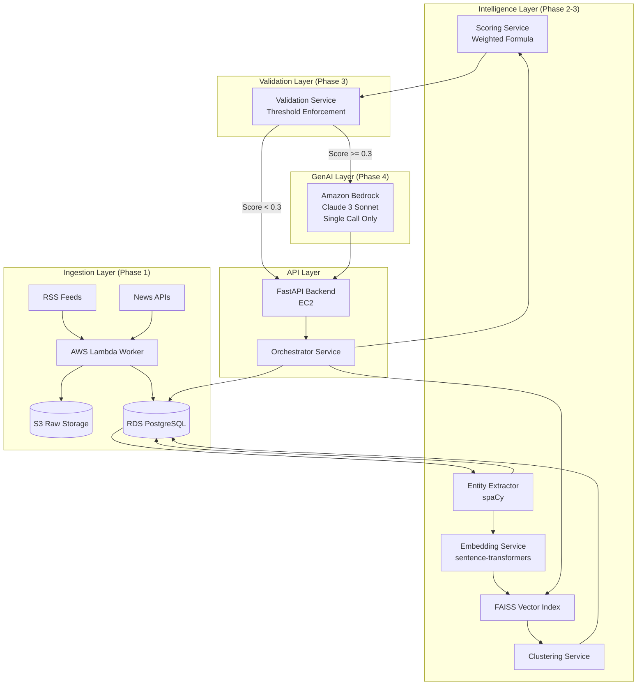

# Design Document: Narad Event Intelligence Platform

## Overview

Narad is a production-ready GenAI-powered event intelligence platform that discovers hidden causal connections between diverse global news events. The platform combines deterministic backend processing with strategic LLM calls for contextual explanation.

**Production Status** (as of 2026-03-07):
- **Data Scale**: 5,313 articles across 134 sources, 12 languages
- **Performance**: 19ms feed response, <5ms FAISS search, <2s chain detection
- **Test Coverage**: 72/72 tests passing
- **Architecture**: FastAPI + PostgreSQL + FAISS + Redis + AWS Bedrock

Key design principles:
- **Dual-pass cross-lingual NER** - Hindi and English entity matching via transliteration
- **Multilingual semantic embeddings** - paraphrase-multilingual-MiniLM-L12-v2 for cross-language similarity
- **Enhanced weighted scoring** - 5-component formula with source credibility weighting
- **Two-model LLM strategy** - Claude Haiku 4.5 (fast) + DeepSeek V3.2 (deep)
- **Multi-hop causal chains** - Cross-domain transition matrix with signal amplification
- **Event intelligence network** - On-demand multi-signal analysis with confidence assessment
- **Redis caching layer** - Graceful degradation for high performance
- **Modular architecture** - Each service is independent and testable

## Architecture

The system follows a modular pipeline architecture with clear separation between deterministic processing and GenAI explanation.



### Phased Implementation Plan

**Phase 1: Basic Ingestion (Day 1)**
- FastAPI skeleton with health check endpoint
- PostgreSQL schema for articles, entities, clusters
- Lambda function for RSS/API fetching
- EventBridge scheduler for periodic ingestion
- S3 bucket for raw article storage
- No embeddings, no LLM

**Phase 2: Entity Extraction and Embeddings (Day 2)**
- spaCy integration for entity extraction
- sentence-transformers for embedding generation
- FAISS index for vector similarity
- Event clustering using DBSCAN
- No LLM yet

**Phase 3: Scoring and Validation (Day 3)**
- Weighted scoring formula implementation
- Validation service with threshold enforcement
- API endpoints for news listing and comparison
- Deterministic relation detection complete
- Still no LLM

**Phase 4: Bedrock Integration (Day 3-4)**
- LLM service with single Bedrock call
- Structured JSON input formatting
- Contextual explanation parsing
- Budget tracking and limits
- Full system operational

**Phase 5: AWS Deployment (Day 4)**
- EC2 instance setup and configuration
- RDS PostgreSQL deployment
- Lambda deployment with EventBridge
- S3 bucket configuration
- End-to-end testing

## Components and Interfaces

### Ingestion Service (Lambda + EventBridge)

**Purpose**: Periodically fetch news from RSS feeds and APIs, normalize format, and store in S3 + PostgreSQL.

**Key Responsibilities**:
- Fetch articles from configured sources on schedule
- Normalize to standard format (title, content, source, URL, timestamp)
- Deduplicate by URL
- Store raw content in S3, metadata in PostgreSQL

**Interface**:
```python
class IngestionService:
    def fetch_from_rss(self, feed_url: str) -> List[RawArticle]:
        """Fetch articles from RSS feed"""
        
    def fetch_from_api(self, api_config: APIConfig) -> List[RawArticle]:
        """Fetch articles from news API"""
        
    def normalize_article(self, raw: RawArticle) -> NormalizedArticle:
        """Convert to standard format"""
        
    def store_article(self, article: NormalizedArticle) -> ArticleID:
        """Store in S3 + PostgreSQL"""
        
    def deduplicate(self, url: str) -> bool:
        """Check if article already exists"""
```

**Data Model**:
```python
@dataclass
class NormalizedArticle:
    id: str
    title: str
    content: str
    source: str
    url: str
    published_at: datetime
    s3_key: str
```

### Entity Extraction Service (spaCy)

**Purpose**: Extract entities from articles using deterministic NLP without LLM calls.

**Key Responsibilities**:
- Use spaCy NER to identify persons, organizations, locations
- Store entities in PostgreSQL with article associations
- Maintain entity-article relationships
- No LLM calls - purely deterministic

**Interface**:
```python
class EntityExtractor:
    def __init__(self):
        self.nlp = spacy.load("en_core_web_sm")
        
    def extract_entities(self, article_id: str, text: str) -> List[Entity]:
        """Extract entities using spaCy NER"""
        
    def store_entities(self, article_id: str, entities: List[Entity]) -> None:
        """Store entities and associations in PostgreSQL"""
        
    def get_article_entities(self, article_id: str) -> List[Entity]:
        """Retrieve entities for an article"""
```

**Data Model**:
```python
@dataclass
class Entity:
    id: str
    text: str
    type: EntityType  # PERSON, ORG, GPE
    article_id: str
    
class EntityType(Enum):
    PERSON = "PERSON"
    ORGANIZATION = "ORG"
    LOCATION = "GPE"
```

### Embedding Service (sentence-transformers)

**Purpose**: Generate vector embeddings for semantic similarity without cloud API calls.

**Key Responsibilities**:
- Use local sentence-transformers model
- Generate embeddings for article content
- Store embeddings in FAISS index
- Persist FAISS index to disk
- No Bedrock or cloud embedding calls

**Interface**:
```python
class EmbeddingService:
    def __init__(self):
        self.model = SentenceTransformer('all-MiniLM-L6-v2')
        self.faiss_index = faiss.IndexFlatL2(384)
        
    def generate_embedding(self, text: str) -> np.ndarray:
        """Generate embedding vector"""
        
    def add_to_index(self, article_id: str, embedding: np.ndarray) -> None:
        """Add embedding to FAISS index"""
        
    def find_similar(self, embedding: np.ndarray, k: int) -> List[Tuple[str, float]]:
        """Find k most similar articles"""
        
    def save_index(self, path: str) -> None:
        """Persist FAISS index to disk"""
```

### Clustering Service (FAISS + DBSCAN)

**Purpose**: Group related events using vector similarity and density-based clustering.

**Key Responsibilities**:
- Use FAISS for fast similarity search
- Apply DBSCAN for density-based clustering
- Store cluster assignments in PostgreSQL
- Calculate cluster centroids
- No LLM involvement

**Interface**:
```python
class ClusteringService:
    def __init__(self, embedding_service: EmbeddingService):
        self.embedding_service = embedding_service
        
    def cluster_articles(self, article_ids: List[str]) -> Dict[str, int]:
        """Assign articles to clusters using DBSCAN"""
        
    def get_cluster_members(self, cluster_id: int) -> List[str]:
        """Get all articles in a cluster"""
        
    def calculate_centroid(self, cluster_id: int) -> np.ndarray:
        """Calculate cluster centroid"""
```

**Data Model**:
```python
@dataclass
class Cluster:
    id: int
    article_ids: List[str]
    centroid: np.ndarray
    created_at: datetime
```

### Scoring Service (Weighted Formula)

**Purpose**: Calculate deterministic relation scores using weighted components.

**Key Responsibilities**:
- Calculate embedding similarity (cosine distance)
- Calculate entity overlap (Jaccard similarity)
- Calculate temporal proximity (time difference)
- Calculate source diversity (unique sources ratio)
- Calculate graph distance (cluster-based)
- Combine using weighted formula: 0.40×embedding + 0.25×entity + 0.15×temporal + 0.10×source + 0.10×graph

**Interface**:
```python
class ScoringService:
    def calculate_relation_score(
        self, 
        article1_id: str, 
        article2_id: str
    ) -> RelationScore:
        """Calculate weighted relation score"""
        
    def embedding_similarity(self, emb1: np.ndarray, emb2: np.ndarray) -> float:
        """Cosine similarity between embeddings"""
        
    def entity_overlap(self, entities1: Set[str], entities2: Set[str]) -> float:
        """Jaccard similarity of entity sets"""
        
    def temporal_proximity(self, time1: datetime, time2: datetime) -> float:
        """Score based on time difference"""
        
    def source_diversity(self, sources: List[str]) -> float:
        """Ratio of unique sources"""
        
    def graph_distance(self, cluster1: int, cluster2: int) -> float:
        """Distance based on cluster assignments"""
```

**Data Model**:
```python
@dataclass
class RelationScore:
    total_score: float
    embedding_sim: float
    entity_overlap: float
    temporal_proximity: float
    source_diversity: float
    graph_distance: float
    
    def to_dict(self) -> dict:
        """Convert to dictionary for JSON serialization"""
```

### Validation Service (Threshold Enforcement)

**Purpose**: Enforce thresholds and budget limits before allowing Bedrock calls.

**Key Responsibilities**:
- Check if relation score exceeds minimum threshold (0.3)
- Track Bedrock calls per user session
- Enforce maximum call limits
- Reject requests that don't meet criteria
- Prevent budget overruns

**Interface**:
```python
class ValidationService:
    SCORE_THRESHOLD = 0.3
    MAX_CALLS_PER_SESSION = 10
    
    def validate_llm_call(
        self, 
        relation_score: float, 
        session_id: str
    ) -> ValidationResult:
        """Check if LLM call is allowed"""
        
    def track_bedrock_call(self, session_id: str) -> None:
        """Increment call counter for session"""
        
    def get_call_count(self, session_id: str) -> int:
        """Get number of calls made in session"""
```

**Data Model**:
```python
@dataclass
class ValidationResult:
    allowed: bool
    reason: str
    score: float
    calls_remaining: int
```

### LLM Service (Amazon Bedrock)

**Purpose**: Make single Bedrock call to generate contextual explanation.

**Key Responsibilities**:
- Format structured JSON input for Claude
- Make exactly one Bedrock API call
- Parse and return contextual explanation
- Handle failures with fallback explanations
- No recursive calls or tool-calling

**Interface**:
```python
class LLMService:
    def __init__(self):
        self.bedrock = boto3.client('bedrock-runtime')
        self.model_id = 'anthropic.claude-3-sonnet-20240229-v1:0'
        
    def generate_explanation(
        self, 
        article1: Article,
        article2: Article,
        relation_score: RelationScore,
        shared_entities: List[Entity]
    ) -> str:
        """Make single Bedrock call for explanation"""
        
    def format_input(
        self,
        article1: Article,
        article2: Article,
        relation_score: RelationScore,
        shared_entities: List[Entity]
    ) -> dict:
        """Format structured JSON input"""
        
    def parse_response(self, response: dict) -> str:
        """Extract explanation from Bedrock response"""
        
    def fallback_explanation(self, relation_score: RelationScore) -> str:
        """Generate deterministic fallback if Bedrock fails"""
```

**Bedrock Input Format**:
```json
{
  "event1": {
    "title": "...",
    "summary": "...",
    "source": "...",
    "published_at": "..."
  },
  "event2": {
    "title": "...",
    "summary": "...",
    "source": "...",
    "published_at": "..."
  },
  "shared_entities": ["entity1", "entity2"],
  "relation_score": {
    "total": 0.65,
    "embedding_similarity": 0.72,
    "entity_overlap": 0.60,
    "temporal_proximity": 0.85,
    "source_diversity": 0.50,
    "graph_distance": 0.40
  },
  "temporal_context": "Event 2 occurred 3 days after Event 1"
}
```

### Orchestrator Service

**Purpose**: Coordinate the entire pipeline from user request to response.

**Key Responsibilities**:
- Handle API requests
- Execute deterministic pipeline
- Call validation service
- Conditionally invoke LLM service
- Return structured responses
- Enforce single Bedrock call constraint

**Interface**:
```python
class Orchestrator:
    def __init__(
        self,
        scoring_service: ScoringService,
        validation_service: ValidationService,
        llm_service: LLMService
    ):
        self.scoring = scoring_service
        self.validation = validation_service
        self.llm = llm_service
        
    def get_recent_news(self, limit: int) -> List[ArticleSummary]:
        """Return recent articles with entities and clusters"""
        
    def compare_events(
        self, 
        article1_id: str, 
        article2_id: str,
        session_id: str
    ) -> ComparisonResult:
        """Execute full pipeline: score -> validate -> LLM"""
        
    def _execute_deterministic_pipeline(
        self,
        article1_id: str,
        article2_id: str
    ) -> Tuple[RelationScore, List[Entity]]:
        """Run scoring and entity extraction"""
```

**Data Model**:
```python
@dataclass
class ComparisonResult:
    article1: ArticleSummary
    article2: ArticleSummary
    relation_score: RelationScore
    shared_entities: List[Entity]
    explanation: Optional[str]  # None if validation failed
    validation_result: ValidationResult
```

## Data Models

### Database Schema (PostgreSQL)

```sql
-- Articles table
CREATE TABLE articles (
    id UUID PRIMARY KEY,
    title TEXT NOT NULL,
    content TEXT NOT NULL,
    source VARCHAR(255) NOT NULL,
    url TEXT UNIQUE NOT NULL,
    published_at TIMESTAMP NOT NULL,
    s3_key TEXT NOT NULL,
    created_at TIMESTAMP DEFAULT NOW()
);

-- Entities table
CREATE TABLE entities (
    id UUID PRIMARY KEY,
    text VARCHAR(255) NOT NULL,
    type VARCHAR(50) NOT NULL,  -- PERSON, ORG, GPE
    created_at TIMESTAMP DEFAULT NOW()
);

-- Article-Entity associations
CREATE TABLE article_entities (
    article_id UUID REFERENCES articles(id),
    entity_id UUID REFERENCES entities(id),
    PRIMARY KEY (article_id, entity_id)
);

-- Clusters table
CREATE TABLE clusters (
    id SERIAL PRIMARY KEY,
    centroid_s3_key TEXT,
    created_at TIMESTAMP DEFAULT NOW()
);

-- Article-Cluster assignments
CREATE TABLE article_clusters (
    article_id UUID REFERENCES articles(id),
    cluster_id INTEGER REFERENCES clusters(id),
    PRIMARY KEY (article_id, cluster_id)
);

-- Bedrock call tracking
CREATE TABLE bedrock_calls (
    id UUID PRIMARY KEY,
    session_id VARCHAR(255) NOT NULL,
    article1_id UUID REFERENCES articles(id),
    article2_id UUID REFERENCES articles(id),
    relation_score FLOAT NOT NULL,
    explanation TEXT,
    created_at TIMESTAMP DEFAULT NOW()
);

CREATE INDEX idx_articles_published ON articles(published_at DESC);
CREATE INDEX idx_articles_source ON articles(source);
CREATE INDEX idx_entities_type ON entities(type);
CREATE INDEX idx_bedrock_session ON bedrock_calls(session_id);
```

### Python Data Models

```python
from dataclasses import dataclass
from datetime import datetime
from typing import List, Optional
from enum import Enum
import numpy as np

@dataclass
class Article:
    id: str
    title: str
    content: str
    source: str
    url: str
    published_at: datetime
    s3_key: str
    entities: Optional[List['Entity']] = None
    cluster_id: Optional[int] = None

@dataclass
class Entity:
    id: str
    text: str
    type: str  # PERSON, ORG, GPE
    
@dataclass
class RelationScore:
    total_score: float
    embedding_sim: float
    entity_overlap: float
    temporal_proximity: float
    source_diversity: float
    graph_distance: float
    
@dataclass
class ValidationResult:
    allowed: bool
    reason: str
    score: float
    calls_remaining: int
    
@dataclass
class ComparisonResult:
    article1: Article
    article2: Article
    relation_score: RelationScore
    shared_entities: List[Entity]
    explanation: Optional[str]
    validation_result: ValidationResult
```

### API Request/Response Models

```python
from pydantic import BaseModel
from typing import List, Optional

class ArticleSummary(BaseModel):
    id: str
    title: str
    source: str
    published_at: str
    entities: List[str]
    cluster_id: Optional[int]

class CompareRequest(BaseModel):
    article1_id: str
    article2_id: str
    session_id: str

class CompareResponse(BaseModel):
    article1: ArticleSummary
    article2: ArticleSummary
    relation_score: dict
    shared_entities: List[str]
    explanation: Optional[str]
    validation: dict
```

## Correctness Properties

*A property is a characteristic or behavior that should hold true across all valid executions of a system—essentially, a formal statement about what the system should do. Properties serve as the bridge between human-readable specifications and machine-verifiable correctness guarantees.*

### Property 1: Article Normalization Completeness
*For any* raw article fetched from RSS feeds or APIs, when normalized by the Ingestion_Service, the result should contain all required fields (title, content, source, URL, timestamp) with valid values.
**Validates: Requirements 1.2**

### Property 2: Storage Round-Trip Consistency
*For any* normalized article, after storing in S3 and PostgreSQL, retrieving the article should produce data equivalent to the original normalized article.
**Validates: Requirements 1.3**

### Property 3: URL Deduplication Idempotence
*For any* article URL, attempting to ingest it multiple times should result in exactly one article stored in the database, regardless of how many ingestion attempts are made.
**Validates: Requirements 1.4**

### Property 4: Source Failure Isolation
*For any* set of configured news sources, when one source fails during ingestion, the Ingestion_Service should successfully process all other available sources without interruption.
**Validates: Requirements 1.5**

### Property 5: Entity Extraction Storage Consistency
*For any* article with extracted entities, all entities should be stored in PostgreSQL with correct article associations, and retrieving entities for that article should return the same set of entities.
**Validates: Requirements 2.2**

### Property 6: Entity-Article Referential Integrity
*For any* entity-article association stored in the database, both the entity and the article should exist in their respective tables, maintaining referential integrity.
**Validates: Requirements 2.5**

### Property 7: Deterministic Processing Without LLM
*For any* article processed through ingestion, entity extraction, embedding generation, and clustering, no calls should be made to Bedrock or any cloud-based LLM service.
**Validates: Requirements 2.3, 3.3, 4.4**

### Property 8: Embedding Index Persistence
*For any* FAISS index updated with new embeddings, after persisting to disk and reloading, the index should contain all previously added embeddings and return identical similarity search results.
**Validates: Requirements 3.5**

### Property 9: Cluster Assignment Consistency
*For any* set of articles clustered by the Clustering_Service, all cluster assignments should be stored in PostgreSQL, and retrieving cluster members should return the same articles assigned to each cluster.
**Validates: Requirements 4.3**

### Property 10: Weighted Scoring Formula Correctness
*For any* two articles with calculated component scores (embedding similarity, entity overlap, temporal proximity, source diversity, graph distance), the total relation score should equal: 0.40×embedding_sim + 0.25×entity_overlap + 0.15×temporal + 0.10×source_diversity + 0.10×graph_distance.
**Validates: Requirements 5.5**

### Property 11: Threshold Validation Correctness
*For any* relation score, the Validation_Service should allow Bedrock calls if and only if the score exceeds 0.3, rejecting requests below threshold with an appropriate message.
**Validates: Requirements 6.1, 6.2, 6.3**

### Property 12: Bedrock Call Limit Enforcement
*For any* user session, the Validation_Service should track the number of Bedrock calls and reject requests once the maximum limit is reached, returning a budget limit message.
**Validates: Requirements 6.4, 6.5**

### Property 13: Single Bedrock Call Per Interaction
*For any* user interaction requesting event comparison, the Orchestrator should make at most one call to Amazon Bedrock, regardless of the complexity of the request.
**Validates: Requirements 7.1, 8.4**

### Property 14: Bedrock Input Structure Completeness
*For any* validated comparison request, the JSON input to Bedrock should contain all required fields: event summaries, shared entities, relation score components, and temporal context.
**Validates: Requirements 7.2**

### Property 15: Bedrock Failure Fallback
*For any* Bedrock call that fails or times out, the LLM_Service should return a fallback explanation generated from deterministic scoring components without making additional LLM calls.
**Validates: Requirements 7.5**

### Property 16: Comparison Result Completeness
*For any* event comparison request, the response should include relation score breakdown, shared entities, and either an LLM-generated explanation (if threshold passed) or a rejection message (if threshold failed).
**Validates: Requirements 8.3**

### Property 17: API Response Time Bounds
*For any* API request to the Orchestrator, the response time should be within 5 seconds for cached results and within 15 seconds for requests requiring new Bedrock calls.
**Validates: Requirements 10.5**

## Error Handling

### Ingestion Errors

**Source Unavailability**: When RSS feeds or news APIs are unavailable, the Ingestion_Service should log the error with source details, skip that source, and continue processing other available sources without system failure.

**Malformed Content**: When fetched content cannot be parsed or is missing required fields, the service should log the error, attempt basic field extraction, and store partial data with a flag indicating incomplete processing.

**S3 Upload Failures**: When S3 uploads fail, the service should retry with exponential backoff (3 attempts), and if all attempts fail, store content in PostgreSQL with a flag for later S3 migration.

### Processing Errors

**Entity Extraction Failures**: When spaCy fails to process article text (e.g., due to encoding issues), the service should log the error, mark the article as partially processed, and continue with embedding generation using the raw text.

**Embedding Generation Failures**: When sentence-transformers fails to generate embeddings, the service should log the error, mark the article as unembedded, and exclude it from clustering until manual review.

**Clustering Failures**: When DBSCAN clustering fails or produces degenerate clusters, the service should log the error, assign articles to a default "unclustered" cluster, and continue operation.

### Validation and LLM Errors

**Threshold Rejection**: When relation scores fall below the 0.3 threshold, the Validation_Service should return a clear message explaining the insufficient connection and provide the score breakdown for transparency.

**Bedrock API Failures**: When Bedrock calls fail due to network issues, rate limits, or service errors, the LLM_Service should return a fallback explanation generated from deterministic scoring components without retrying the LLM call.

**Bedrock Timeout**: When Bedrock calls exceed 10 seconds, the service should cancel the request and return a fallback explanation to maintain the 15-second API response time constraint.

### Database Errors

**PostgreSQL Connection Failures**: When database connections fail, the service should retry with exponential backoff (5 attempts), and if all attempts fail, return HTTP 503 with a clear error message indicating temporary unavailability.

**Referential Integrity Violations**: When attempting to create entity-article associations for non-existent entities or articles, the service should log the error, skip the association, and continue processing other associations.

**FAISS Index Corruption**: When the FAISS index cannot be loaded from disk, the service should rebuild the index from embeddings stored in PostgreSQL, log the rebuild operation, and continue normal operation.

## Testing Strategy

### Dual Testing Approach

The Narad platform requires comprehensive testing using both unit tests and property-based tests to ensure correctness across the deterministic pipeline and GenAI integration:

**Unit Tests** focus on:
- Specific examples of article normalization and entity extraction
- Integration points between services (ingestion → entity extraction → embeddings)
- Edge cases in scoring calculations (zero entity overlap, identical timestamps)
- Error conditions and fallback behavior (Bedrock failures, database errors)
- API endpoint behavior and response formatting

**Property-Based Tests** focus on:
- Universal properties that hold across all article types and sources
- Comprehensive input coverage through randomized article generation
- System behavior under various scoring scenarios
- Correctness guarantees for the weighted scoring formula
- Validation and threshold enforcement across all possible scores

### Property-Based Testing Configuration

**Testing Framework**: Hypothesis (Python) for backend services

**Test Configuration**:
- Minimum 100 iterations per property test to ensure statistical significance
- Custom generators for realistic articles, entities, embeddings, and scores
- Shrinking strategies to find minimal failing examples when properties fail
- Parallel execution for performance-critical properties

**Property Test Tagging**:
Each property-based test must include a comment referencing its design document property:
```python
# Feature: narad, Property 2: Storage Round-Trip Consistency
@given(normalized_article())
def test_storage_round_trip(article):
    # Test implementation
```

### Integration Testing Strategy

**End-to-End Pipeline Testing**:
- Test complete flow from ingestion through scoring
- Verify deterministic pipeline produces consistent results
- Test Bedrock integration with mocked responses
- Validate threshold enforcement and call limiting

**Database Integration Testing**:
- Test PostgreSQL schema with realistic data volumes
- Verify referential integrity constraints
- Test FAISS index persistence and recovery
- Validate concurrent access patterns

**AWS Service Integration Testing**:
- Test Lambda function with EventBridge triggers
- Verify S3 upload and retrieval
- Test RDS connection pooling and failover
- Validate Bedrock API integration with real calls (limited)

### Performance Testing

**Response Time Testing**:
- Verify API responses within 5 seconds for cached results
- Verify API responses within 15 seconds for Bedrock calls
- Test deterministic pipeline latency (target: < 2 seconds)

**Load Testing**:
- Test concurrent API requests (target: 50 concurrent users)
- Test ingestion throughput (target: 100 articles/minute)
- Test FAISS similarity search performance (target: < 100ms)

**Budget Testing**:
- Track Bedrock call counts and costs
- Verify call limiting prevents budget overruns
- Test system behavior when limits are reached

### Security Testing

**Input Validation Testing**:
- Test resistance to malicious article content
- Verify proper sanitization of user inputs
- Test SQL injection prevention in database queries

**API Security Testing**:
- Test authentication and authorization (if implemented)
- Verify rate limiting on API endpoints
- Test CORS configuration for web access