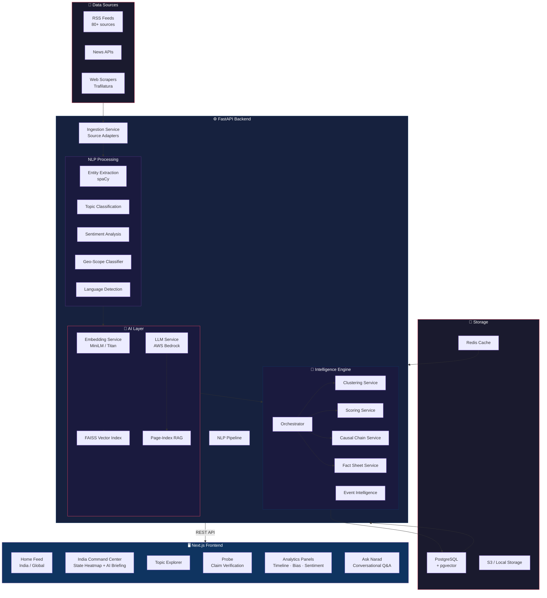
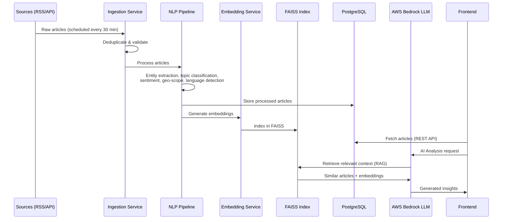

<](https://fastapi.tiangolo.com/)
[](https://nextjs.org/)
[](https://aws.amazon.com/bedrock/)
[](https://www.postgresql.org/)

</div>

---

## 📌 What is Narad?

Narad is a **GenAI-powered event intelligence platform** that aggregates news from 80+ Indian and global sources across 10+ languages, processes them through NLP pipelines, and surfaces AI-driven insights like cross-source validation, narrative conflict detection, causal chain analysis, and state-level sentiment mapping.

### Key Features

- 🔄 **Real-time ingestion** from 80+ RSS feeds and APIs (scheduled every 30 min)
- 🌐 **Multilingual support** — Hindi, Tamil, Telugu, Bengali, Marathi, Gujarati, Kannada, Malayalam, Urdu, English
- 🧠 **AI Analysis** via AWS Bedrock (Llama 3.3 70B, DeepSeek, Amazon Nova Pro)
- 🗺️ **India Command Center** — state-level heatmaps, sentiment tracking, AI briefings
- 🔍 **Probe** — paste any claim, get cross-validated matches with credibility scoring
- 📊 **Analytics** — timeline reconstruction, source bias detection, sentiment trends
- 🔗 **Event Intelligence** — explore causal chains and narrative connections across stories
- 💬 **Ask Narad** — conversational RAG-powered Q&A over the entire news corpus

---

## 🏗️ Architecture



### Data Flow



### API Routes

```mermaid
graph LR
    subgraph API["FastAPI Routes"]
        NEWS["/api/news"]
        TOPICS["/api/topics"]
        PROBE["/api/probe"]
        COMPARE["/api/compare"]
        ANALYTICS["/api/analytics"]
        DASHBOARD["/api/dashboard"]
        CHAT["/api/chat"]
        SOURCES["/api/sources"]
    end

    NEWS -->|GET /| List Articles
    NEWS -->|GET /:id| Article Detail
    NEWS -->|POST /:id/analyze| Deep Analysis
    NEWS -->|POST /:id/explore| Event Intelligence
    NEWS -->|GET /:id/fact-sheet| Fact Sheet
    TOPICS -->|GET /| Topic Distribution
    PROBE -->|POST /| Claim Verification
    COMPARE -->|POST /| Article Comparison
    ANALYTICS -->|GET /timeline/:id| Event Timeline
    ANALYTICS -->|GET /sentiment/topic/:t| Sentiment Trends
    ANALYTICS -->|POST /bias/:id| Source Bias
    DASHBOARD -->|GET /heatmap| India State Heatmap
    DASHBOARD -->|POST /briefing/:state| AI Briefing
    DASHBOARD -->|POST /ask| Ask Narad
    DASHBOARD -->|GET /markets| Market Data
    DASHBOARD -->|POST /situation-room| Situation Room
    DASHBOARD -->|GET /narrative-conflicts| Narrative Conflicts
    SOURCES -->|GET /health| Source Health Monitor

    style API fill:#16213e,stroke:#0f3460,color:#fff
```

---

## 🛠️ Tech Stack

| Layer | Technology |
|---|---|
| **Frontend** | Next.js 16, React 19, TypeScript, Tailwind CSS, Framer Motion |
| **Backend** | FastAPI, Python 3.11+, Uvicorn, APScheduler |
| **AI / LLM** | AWS Bedrock (Llama 3.3 70B, DeepSeek, Amazon Nova Pro) |
| **NLP** | spaCy, sentence-transformers (MiniLM), langdetect, Unidecode |
| **Vector Search** | FAISS (CPU), pgvector |
| **Database** | PostgreSQL (async via SQLAlchemy + asyncpg) |
| **Caching** | Redis |
| **Ingestion** | feedparser, httpx, trafilatura (full-text extraction) |
| **Cloud** | AWS (Bedrock, S3, Amplify) |
| **Containerization** | Docker |

---

## 🚀 Getting Started

### Prerequisites

- **Python 3.11+**
- **Node.js 20+**
- **PostgreSQL** (running locally or remote)
- **Redis** (optional, for caching)
- **AWS credentials** (for Bedrock LLM features)

### Backend Setup

```bash
cd backend

# Create virtual environment
python -m venv venv
source venv/bin/activate  # Windows: venv\Scripts\activate

# Install dependencies
pip install -r requirements.txt

# Download spaCy model
python -m spacy download en_core_web_sm

# Create .env file
cp .env.example .env
# Edit .env with your DATABASE_URL, AWS credentials, etc.

# Run the server
uvicorn app.main:app --reload --port 8000
```

### Frontend Setup

```bash
cd frontend

# Install dependencies
npm install --legacy-peer-deps

# Run dev server
npm run dev
```

The frontend will be available at `http://localhost:3000` and connects to the backend at `http://localhost:8000`.

### Environment Variables

| Variable | Description | Default |
|---|---|---|
| `DATABASE_URL` | PostgreSQL connection string | `postgresql+asyncpg://...@localhost/narad` |
| `STORAGE_BACKEND` | `local` or `s3` | `local` |
| `LLM_BACKEND` | `mock` or `bedrock` | `bedrock` |
| `EMBEDDING_BACKEND` | `local` or `titan` | `local` |
| `AWS_REGION` | AWS region for Bedrock | `us-east-1` |
| `NEWS_API_KEY` | NewsAPI key (optional) | — |
| `REDIS_URL` | Redis connection URL | — |

---

## 📁 Project Structure

```
Narad/
├── backend/
│   ├── app/
│   │   ├── main.py              # FastAPI entry point + lifespan
│   │   ├── config.py            # Pydantic settings
│   │   ├── database.py          # SQLAlchemy async engine
│   │   ├── sources.py           # 80+ source definitions
│   │   ├── models/
│   │   │   ├── article.py       # Article ORM model
│   │   │   └── schemas.py       # Pydantic request/response schemas
│   │   ├── routes/
│   │   │   ├── news_routes.py       # Article CRUD + analysis
│   │   │   ├── dashboard_routes.py  # India Command Center
│   │   │   ├── analytics_routes.py  # Timeline, sentiment, bias
│   │   │   ├── probe_routes.py      # Claim verification
│   │   │   ├── compare_routes.py    # Article comparison
│   │   │   ├── chain_routes.py      # Causal chains
│   │   │   ├── chat_routes.py       # Ask Narad
│   │   │   └── source_routes.py     # Source health
│   │   └── services/
│   │       ├── orchestrator.py          # Central coordination
│   │       ├── ingestion_service.py     # RSS/API ingestion
│   │       ├── llm_service.py           # AWS Bedrock integration
│   │       ├── embedding_service.py     # Vector embeddings
│   │       ├── entity_service.py        # Named entity extraction
│   │       ├── clustering_service.py    # Article clustering
│   │       ├── scoring_service.py       # Relation scoring
│   │       ├── causal_chain_service.py  # Causal chain analysis
│   │       ├── event_intelligence_service.py  # Event exploration
│   │       ├── fact_sheet_service.py     # Multi-source fact sheets
│   │       ├── topic_classifier.py      # Topic classification
│   │       ├── sentiment_service.py     # Sentiment analysis
│   │       ├── geo_scope_classifier.py  # Geographic classification
│   │       ├── page_index_rag.py        # RAG pipeline
│   │       ├── cache_service.py         # Redis caching
│   │       └── storage_service.py       # S3/local storage
│   ├── requirements.txt
│   └── Dockerfile
├── frontend/
│   ├── app/
│   │   ├── page.tsx             # Home feed (India Today)
│   │   ├── layout.tsx           # Root layout
│   │   ├── globals.css          # Design system
│   │   ├── lib/api.ts           # API client
│   │   ├── components/
│   │   │   ├── Navbar.tsx           # Navigation bar
│   │   │   ├── ArticleCard.tsx      # Article display card
│   │   │   ├── AnalyticsPanels.tsx  # Analytics dashboard
│   │   │   ├── SearchOverlay.tsx    # Global search
│   │   │   └── ConnectionPulse.tsx  # Event connections viz
│   │   ├── article/             # Article detail page
│   │   ├── india/               # India Command Center
│   │   ├── global/              # Global news view
│   │   ├── topics/              # Topic explorer
│   │   └── probe/               # Claim verification
│   ├── package.json
│   └── Dockerfile
└── amplify.yml                  # AWS Amplify deployment
```

---

## 🤝 Team

Built for the **AWS AI for Bharat Hackathon**.

---

<div align="center">
<sub>Named after <b>Narad Muni</b> — the divine messenger in Hindu mythology who travels across realms carrying news and wisdom.</sub>
</div>
]]>
